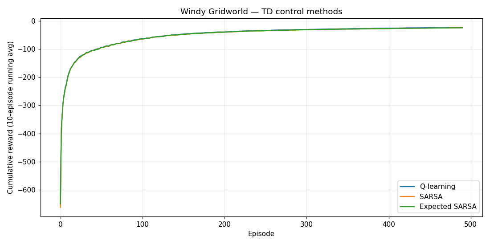
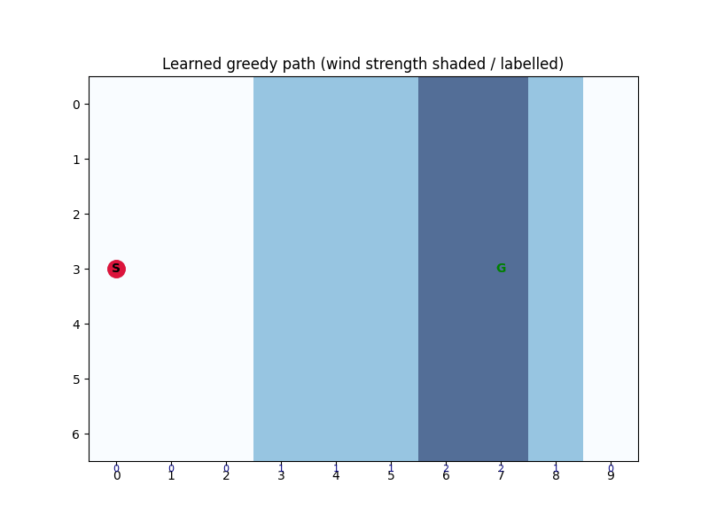

<div align="center">

# WINDY GRIDWORLD // TD CONTROL

**Q-learning, SARSA, and Expected SARSA from scratch on the Sutton & Barto windy gridworld.**


</div>

---

The **windy gridworld** from Sutton & Barto (Example 6.5): a 10×7 grid where a per-column crosswind pushes the agent upward, so the shortest path to the goal has to lean into the wind. The agent gets **−1 per step** until it reaches the goal at `(7, 3)` from the start at `(0, 3)`. Three tabular temporal-difference control methods are implemented from scratch and compared:

| Method | Backup target | On/off-policy |
| :--- | :--- | :---: |
| Q-learning | `max_a' Q(s', a')` | off-policy |
| SARSA | `Q(s', a')` for the actually-taken `a'` | on-policy |
| Expected SARSA | `E_π[Q(s', a')]` under the ε-greedy policy | on-policy |

## Results

<p align="center">

&nbsp;

</p>

- **All three converge to a near-optimal policy** — the learned greedy path reaches the goal in **17 steps**, steering above the goal row so the wind carries the agent back down onto it.
- **Q-learning edges ahead on cumulative reward**, with Expected SARSA the smoothest of the three (lower-variance backup). Curves are averaged over 300 independent runs.

## Reproduce

```bash
pip install numpy matplotlib
python main.py    # trains all three methods -> images/learning_curves.png + agent_path.gif
```

Grid size, wind profile, start/goal, and `episodes`/`trials` are set at the top of `main.py`.

## Repository layout

```
windy_gridworld.py  environment: wind dynamics, step, reset
algorithms.py       q_learning / sarsa / expected_sarsa + train_q_table
visualizations.py   learning-curve plot + greedy-path animation
main.py             train the three methods and render the figures
```

## Limitations

Standard four-move variant only — no king's-move (diagonal) actions or stochastic wind, both of which are the usual follow-up exercises. Fixed ε and α (no decay), so the averaged curves settle a little below the deterministic optimum.

## References

Sutton & Barto, *Reinforcement Learning: An Introduction* (2nd ed.), Example 6.5 · [book](http://incompleteideas.net/book/the-book.html)

MIT — see [`LICENSE`](LICENSE).
